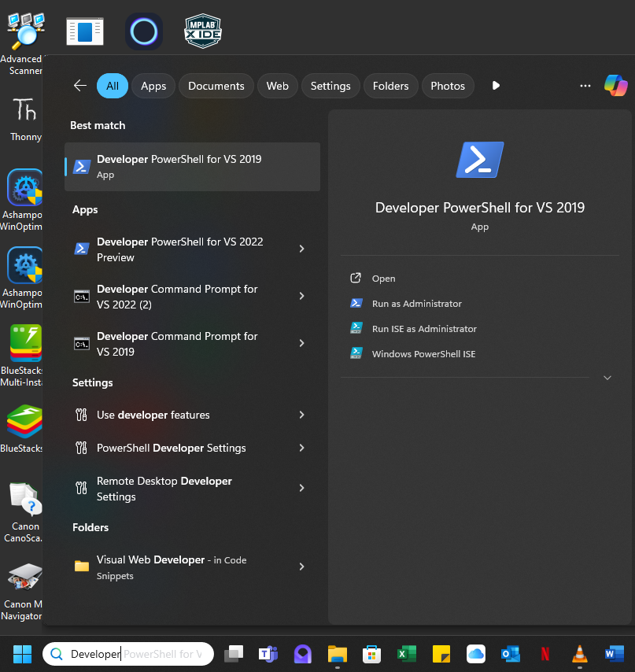
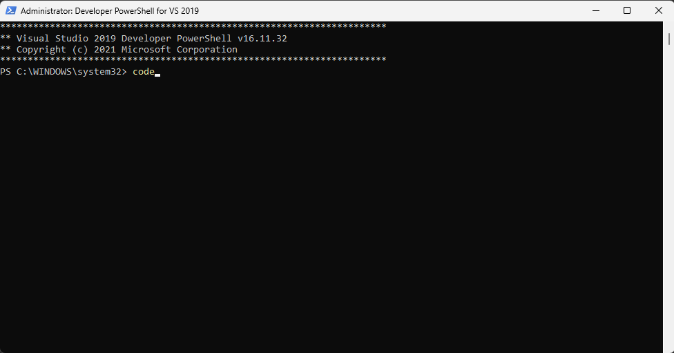
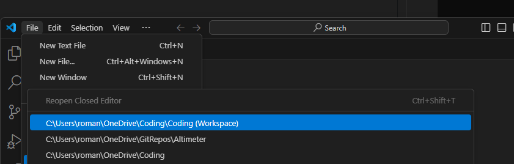
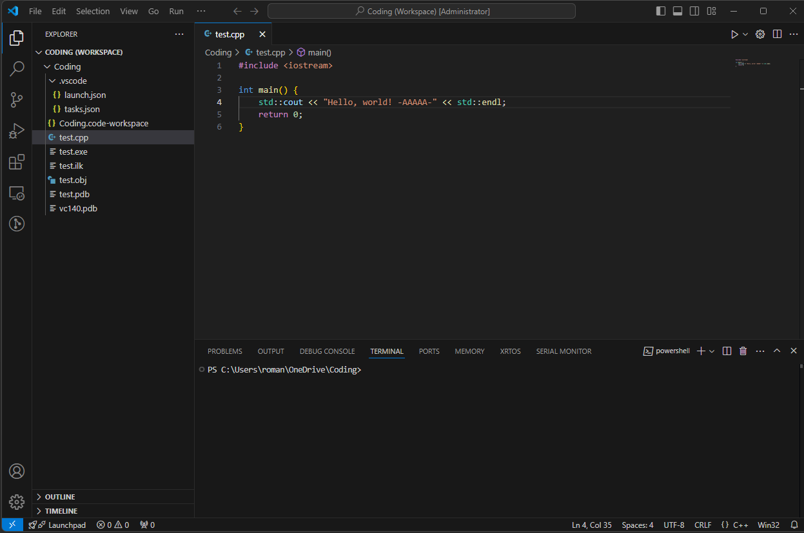
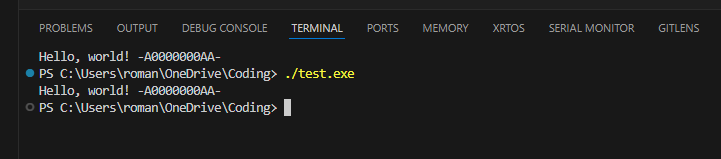

This is just a basic setup for compiling/debugging C++ using the VS Code IDE

Starting C++ In VS Code
Wednesday, 30 October 2024
11:11 AM

Developer=>Run as Administrator

code=>Enter opens VS Code and then open this workspace. THis is linked to the namor5772/Coding GitHub repositrory

